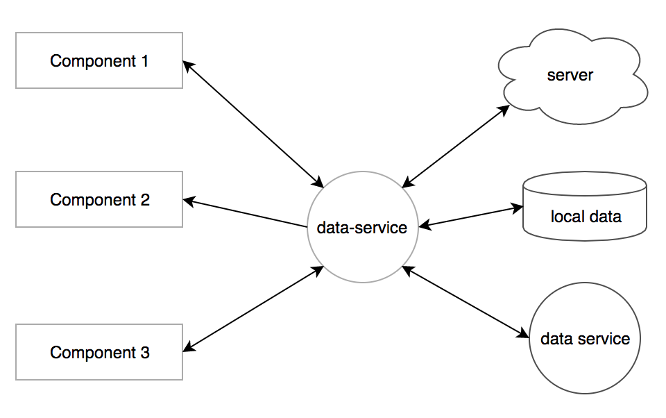

#Super cat

This project explores ES6 future features including using proxy to observe and control components shared data and states
and uses Google [Incremental DOM](https://github.com/google/incremental-dom) to handle dynamic view 
in the static web page.

## Requirements

* [Node.js/NPM](http://nodejs.org/) (v6.9.5)

## Overview
The framework is written in ES6 and uses SystemJs for dependencies management, Gulp for pre-compiling ES6 script into ES5 script 
and the html view templates into incremental dom view functions.

The framework introduces a data service with the observer pattern to handle communication between components and other modules. 
More information about the component examples and the data service is provided below.


## Setup
To get started on this project, you will need to install a list of the libraries:

**Install Node version manager (NVM)**
Recommend to use node version manager [NVM](https://github.com/creationix/nvm/blob/master/README.md), it is easier to
switch different versions of nodeJs for different projects. After the installation, to use node 6.9.x 
```
nvm install 6.9.5
```
Then run 
```
node -v 
```
to check whether the node version is 6.9.x

### Global nodejs packages ###
Once you have Node.js installed you'll need to install node modules [JSPM](http://jspm.io/), [Gulp](http://gulpjs.com/). 
We recommend a global install since these tools are not project-specific:

```
$ [sudo] npm install -g jspm jspm-git gulp jspm-github
```

config github registry
```
jspm registry config github
```
connect bitbucket
```
$ jspm config registries.bitbucket.baseurl ssh://git@bitbucket.org
$ jspm config registries.bitbucket.handler jspm-git
```


### Install node modules and jspm packages ###
Now you can install node modules and jspm packages

```
$ npm install
$ jspm install
```


## Component examples
Base example:
http://localhost:9000/demo/examples/cat-list-counter.html

With data service:
http://localhost:9000/demo/examples/cat-clicker.html

Component examples
```
src/components/_cat-clicker
src/components/audio-player
```

## Component Folder structure ##
```
a-component.js          controller
a-component-tpl.html    SuperviewJs view template
a-component-tpl.js      `gulp build-view-templates` compiles tpl.html into Incremental DOM tpl.js
a-component.scss        scss file
demo.a-component.html   component demo html
```

## Flows ##
### Static view ###

```
controller -> view
```
Example
```src/components/_cat-clicker/cat-list-counter/cat-list-counter.js```


### Dynamic view ###
```
controller -> View model -> view
```

Example
```
src/components/_cat-clicker/cat-list
src/components/_cat-clicker/cat-detail-panel
src/components/_cat-clicker/cat-description-panel
```

A component controller has different views or view models
```
controller 1 -> view model 1 -> view 1
                             -> view 2
                         
controller 1 -> view model 1 -> view 1
             -> view model 2 -> view 2

controller 1 -> view model 1 -> view 1
controller 2 -> view model 2 -> view 1
```


## Data service ##
The data service is developed based on the observer pattern. It takes the responsibility to handle communication 
between components by the shared data, component state changes or synchronise data with other modules including the 
server and the local data etc. The purpose is to make the data flow clear between each of components in a group.




Source: ```src/js/lib/data-service.js```

An example: ```src/components/_cat-clicker/cat-service.js```


### Flow ###

Subscribe to object
```
cat-list | this._data.selectedCat                       cat-service                            cat-detail-panel | this._data.selectedCat
_subscribeToData("selectedCat") ->     subscriber | this._data.selectedCat | subscriber     <- _subscriberToData("selectedCat")

```

Observe and broadcast data changes
```
cat-service                                                  cat-list
_handleObservingDataChanges() -> broadcastDataChanges() ->    handleNotification() -> this._dynamicPartial.view.render() / update dynamic view

                                                             cat-detail-panel
                                                       ->    handleNotification() -> update static view dom element values
```

Use data service if you face one of these situations:

Shared functions or data between components

**Example**
```
international student   ->
                            student-data-service (addStudent(), deleteStudent())
domestic student        ->
```

Components fetch or send data from the same data source (local storage, server API)

**Example**
```
international student -> 
                         student-service                ->  server API/local storage
                         (post, update, get, delete)
domestic student      ->
```

Nested components

**Example**
```
current student
    - international student   
    - domestic student       

current student ->  student-service             <- international student
                   (list, add, find, delete)    <- domestic student

```

Components states have dependencies with each other

**Example**
```
current student ->  student-service                             <- international student
                   (setSelectedStudent, setAvaiableStudents)    <- domestic student

```

Service talk to service

**Example**
```
international student   ->                                     
                            student-sevice <-> teacher-service <- teacher 
domestic student        ->
```
OR

```
international student   ->                                     
                            student-sevice <- student-teacher-service -> teacher-service <- teacher 
domestic student        ->

```


## SuperviewJs and Incremental DOM ##
The framework uses [Incremental DOM](https://github.com/google/incremental-dom) for the dynamic view. 
[SuperviewJs](https://github.com/davidjamesstone/superviews.js/) is a 
template engine to convert a html template into an incremental-dom render function. 

The SuperviewJs playground
http://davidjamesstone.github.io/superviews.js/playground/index.html

Hide the implement details from the view with handlers and keep the view clean and easy to read

**Example**

View

```html
<ul each="student in students">
    <li><h3 class="{vm.handlers.getStudentState(student)}">{student.name}</h3></li>
    <li><h3 class="{vm.handlers.getStudentState(student)}">{student.name}</h3></li>
</ul>
```

Handler for the implement details
```javascript
getStudentState(student) {
    return (selectedStudent === student) ? 
                student.type === "international" ? 
                    "b-student--internal b-student--selected" :
                    "b-student--domestic b-student--selected" :
                student.type === "international" ? 
                "b-student--internal" : 
                "b-student--domestic" ;
}
```

The benefit is the view can be used with different handlers from the same or different controllers

```javascript
getStudentState(student) {
    return (loginUser === student) ? "b-user--login" : "b-user" ;
}    
```

## Component examples
Base example:
http://localhost:9000/demo/examples/cat-list-counter.html

With data service:
http://localhost:9000/demo/examples/cat-clicker.html

Sources
```
src/components/_cat-clicker
src/components/audio-player
```
